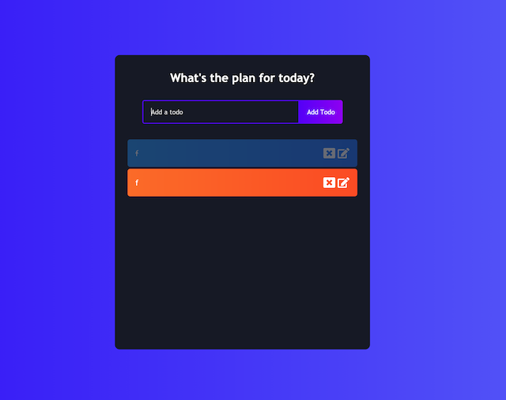

# To-do React

## Table of Contents

* [Deployed Site](#deployed-site)
* [User Story](#user-story)
* [Description](#description)
* [Screenshots](#screenshots)
* [Technologies](#Technologies)

## Deployed Site
---
Deployed Website: https://todo-react-2.herokuapp.com/

## User Story
User Story: 
- As a User, I would like to navigate to an easy to read and stylish day planner app. As a User, I would like to add things i have to do in a list and once task is complete click on the task to show its complete. As a User, I would like to update or remove items on my list as needed.  

## Description
This to-do app is an task listing app that lets you add, update, and delete tasks. 

## Screenshots
---
Home Page

## Technologies

- React.js
- CSS
- Node.Js
- JAVA SCRIPT
- Babel

